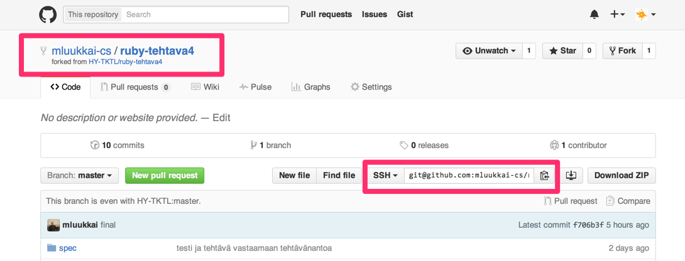

# Ohjeita tehtävien tekemiseen

Oletetaan että koneellesi on asennettu Ruby ja rspec. Jos ei, toimi esim. [tämän](https://github.com/mluukkai/WebPalvelinohjelmointi2016/wiki/railsin-asennus) ohjeen mukaan.

## git

Tarvitset kurssin suorittamista käyttäjätunnuksen GitHub:iin ja pienen määrän git-osaamista. Luo tunnus [täällä](https://github.com/mluukkai/WebPalvelinohjelmointi2016/wiki/Versionhallinta) olevan ohjeen mukaan

## tehtäväpohjan kloonaaminen

Tehtävää klikkaamalla pääset tehtäväpohjan sisältävään GitHub-repositorioon.

Kun olet tehtäväpohjan repositoriossa _forkkaa_ se itsellesi klikkaamalla yläreunassa olevaa painiketta:


Tehtäväpohjasta "kopioituu" nyt repositorio, joka sijoitaan oman githubtunnuksesi alle:



Seuraavaksi kloonataan repositorio omalle koneelle. Copypastaa ylläolevan kuvan oikealle merkityssä laatikossa oleva kloonausosoite (varmista, että clone url on tyyppiä _ssh_).

Avaa komentorivi ja anna komento (kloonausurlina forkkaamasi repositorion url):

```
git clone git@github.com:mluukkai-cs/ruby-tehtava4.git
```

Näin syntyy hakemisto `ruby-tehtava4`. Mene hakemistoon komennolla

```
cd ruby-tehtava4
```

## tehtävän tekeminen ja testaaminen

tee tehtävä tiedostoon ...

suorita koodi..

## tehtävän palauttaminen

pushaa githubiin

tee pullrequesti

