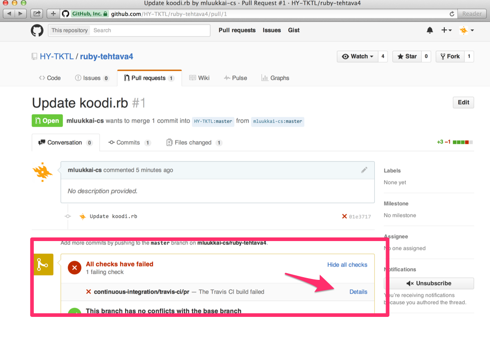

# Ohjeita tehtävien tekemiseen

Oletetaan että koneellesi on asennettu Ruby ja rspec. Jos ei, toimi esim. [tämän](https://github.com/mluukkai/WebPalvelinohjelmointi2016/wiki/railsin-asennus) ohjeen mukaan.

## git

Tarvitset kurssin suorittamista varten käyttäjätunnuksen [GitHub](http://github.com):iin ja pienen määrän git-osaamista. Luo tunnus esim. [täällä](https://github.com/mluukkai/WebPalvelinohjelmointi2016/wiki/Versionhallinta) olevan ohjeen mukaan

## tehtäväpohjan kloonaaminen

Kurssimateriaalin seassa olevien tehtävien nimeä klikkaamalla pääset tehtäväpohjan sisältävään GitHub-repositorioon.

Kun olet tehtäväpohjan repositoriossa _forkkaa_ se itsellesi klikkaamalla yläreunassa olevaa painiketta:


Tehtäväpohjasta "kopioituu" nyt repositorio, joka sijoitaan oman githubtunnuksesi alle:


Seuraavaksi kloonataan repositorio omalle koneelle. Copypastaa ylläolevan kuvan oikealle merkityssä laatikossa oleva kloonausosoite (varmista, että clone url on tyyppiä _ssh_).

Avaa terminaali ja anna komento (kloonausurlina forkkaamasi repositorion url):

```
git clone git@github.com:mluukkai-cs/ruby-tehtava4.git
```

Näin syntyy hakemisto `ruby-tehtava4`. Mene hakemistoon komennolla

```
cd ruby-tehtava4
```

## tehtävän tekeminen ja testaaminen

Tehtävän koodi tehdään kurssin ensimmäisen osan tehtävissä tiedostoon `koodi.rb`

Koodi suoritetaan antamalla terminaalista komento

```
ruby koodi.rb
```

Tehtävään liittyvät testit ovat tidostossa `test_spec.rb`. Testit suoritetaan terminaalista komennolla:

```
rspec test_spec.rb
```

Jos testit eivät mene läpi, kannattaa lukea virheilmoituksia.

## tehtävän palauttaminen

Kun testit menevät paikallisesti läpi, ne palautetaan _pushaamalla_ koodi githubiin.

Ensin koodiin tekemäsi muutokset tulee _commitoida_ versionhallintaan. Tämä tapahtuu antamalla terminaalissa komennot

```
git add koodi.rb
git commit -m"tähän commitviesti eli joku järkevä teksti"
git push
```

Nyt kirjoittamasi koodin pitäisi näkyä GitHub-profiilin alle kloonatussa versiossasi tehtävän repositoriosta (eli samassa joka avautui selaimeen painikkeen _fork_ painamisen jälkeen).

Kun olet varmistanut että koodi näkyy GitHubissa, tulee tehdä _pull request_ klikkaamalla _new pull request_.

Joudut vielä painamaan pariin kertaan hieman erilaisilla sivuilla olevaa painiketta _create pull request_.

Lopulta pull request on tehty:



Pull requestin tekemisen jälkeen koodisi testataan [Travis](travis.org)-palvelun avulla. Menee hetken ennen kuin tieto testien suorituksesta on saatavilla. Klikkaamalla _details_ näet testiraportin. Jos testit ovat menneet läpi paikallisesti, tulisi niiden mennä läpi myös Travisilla.

Tieto suorituksestasi rekisteröityy osoittessa [https://ruby-scoresheet.herokuapp.com/](https://ruby-scoresheet.herokuapp.com/)
olevalle pistelistalle.

Jos testit eivät mennet läpi, korjaa virheet ja palaa [tähän](## tehtävän palauttaminen)
